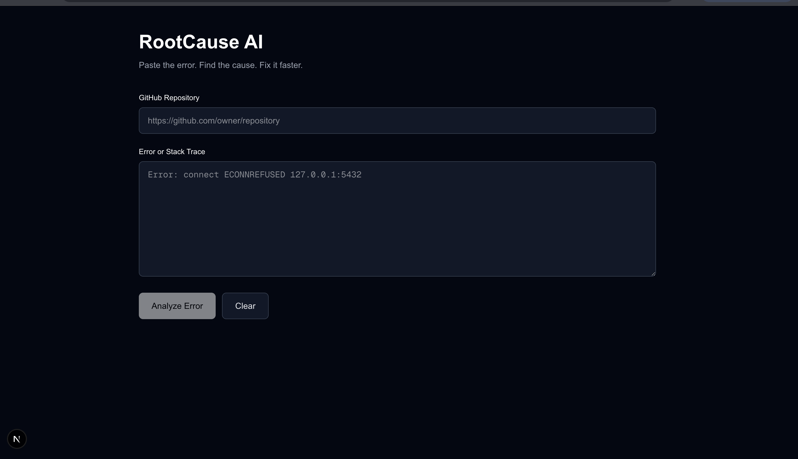
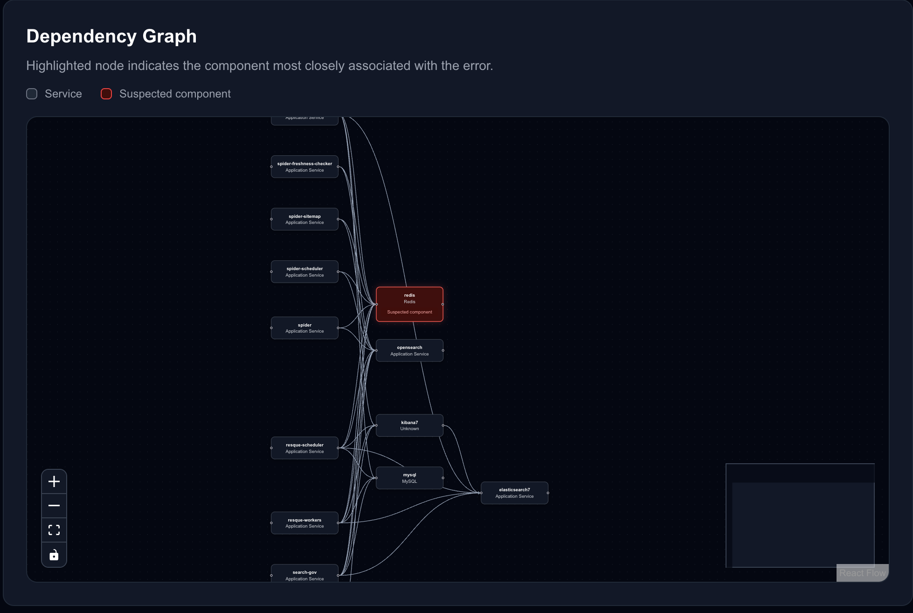
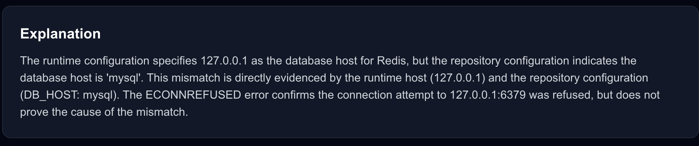
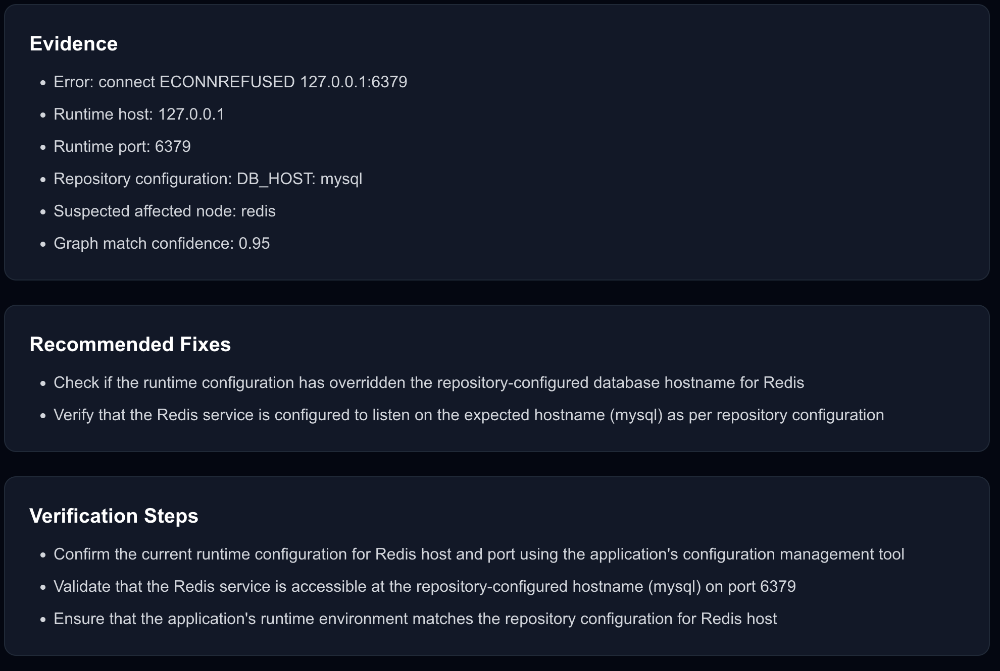

# RootCause AI

> **Paste the error. Find the cause. Fix it faster.**

RootCause AI is an AI-powered developer debugging platform that analyzes runtime errors alongside GitHub repository context to identify likely root causes, affected components, supporting evidence, recommended fixes, and verification steps.

Instead of sending an isolated stack trace directly to an LLM, RootCause AI combines **deterministic repository analysis with LLM reasoning** to produce more grounded and explainable debugging decisions.

---

## Demo

<!-- Replace this path after adding your screenshot -->
<p align="center">
  
</p>

RootCause AI accepts a GitHub repository and runtime error, analyzes the repository architecture, correlates the failure with relevant services, and generates a structured diagnosis.

---

## The Problem

Debugging modern applications often requires correlating information scattered across multiple places:

- runtime errors and stack traces
- application configuration
- Docker Compose services
- environment variables
- repository structure
- service dependencies
- infrastructure technologies

For example, an error such as:

```text
ECONNREFUSED 127.0.0.1:5432
```

tells a developer that a connection failed, but it does not immediately explain:

- What service uses port `5432`?
- Which application component depends on that service?
- Does the runtime hostname match repository configuration?
- Which configuration files are relevant?
- What should be checked first?
- How should the fix be verified?

A generic LLM can reason about the error, but without repository context it may make assumptions that are not supported by the actual application architecture.

RootCause AI addresses this by analyzing the repository **before** asking the LLM to reason about the failure.

---

## How RootCause AI Works

```text
GitHub Repository + Runtime Error
              │
              ▼
       Repository Analysis
              │
              ▼
   Configuration / Compose Parsing
              │
              ▼
       Technology Detection
              │
              ▼
       Dependency Graph
              │
              ▼
  Deterministic Evidence Extraction
              │
              ▼
    Error ↔ Component Correlation
              │
              ▼
        Grounded LLM Reasoning
              │
              ▼
   Structured Root-Cause Diagnosis
```

The key design principle is:

> **Use deterministic code to establish facts. Use the LLM to reason over those facts.**

Ports, hostnames, service relationships, repository configuration, and dependency edges are extracted programmatically whenever possible.

The LLM receives this evidence as structured context and generates the final explanation, recommendations, and verification strategy.

---

# Features

## GitHub Repository Analysis

RootCause AI accepts a public GitHub repository URL and uses the GitHub API to inspect repository structure and relevant files.

The analyzer identifies files such as:

- `package.json`
- `requirements.txt`
- `pyproject.toml`
- `pom.xml`
- `build.gradle`
- `Dockerfile`
- `docker-compose.yml`
- `docker-compose.yaml`
- `.env.example`
- application configuration files

Rather than sending an entire repository to the model, RootCause AI first selects information likely to be useful for diagnosis.

---

## Technology Detection

Repository files and dependency manifests are analyzed to identify technologies used by the application.

Examples include:

- PostgreSQL
- Redis
- MySQL
- MongoDB
- Elasticsearch
- React
- backend application services
- frontend application services

Technology information becomes additional evidence during error correlation.

---

## Docker Compose Analysis

RootCause AI parses Docker Compose configuration to discover application services and their relationships.

For example:

```yaml
services:
  backend:
    depends_on:
      - db

  db:
    image: postgres
```

can be converted into:

```text
backend ──────► db
                │
                └── PostgreSQL
```

This allows the system to reason about application architecture instead of treating every error as an isolated text string.

---

## Dependency Graph

Repository architecture is converted into an interactive dependency graph.

<!-- Replace this path after adding your screenshot -->
<p align="center">
  
</p>

The graph allows developers to visualize:

- detected services
- technologies
- dependency relationships
- the component most closely associated with the error

The suspected component is highlighted so the developer can quickly understand where the failure sits within the application architecture.

The graph is rendered using **React Flow** with **Dagre** for automatic layout.

---

## Error-to-Component Correlation

RootCause AI extracts deterministic signals from runtime errors and correlates them with repository infrastructure.

For example:

```text
ECONNREFUSED 127.0.0.1:5432
```

contains several useful signals:

```text
Host → 127.0.0.1
Port → 5432
Protocol/Failure → connection refused
```

Port `5432` can be associated with PostgreSQL.

If the repository dependency graph also contains a PostgreSQL service, that becomes additional evidence that the database component may be associated with the failure.

The current deterministic matcher recognizes infrastructure signals for technologies including:

```text
5432  → PostgreSQL
3306  → MySQL
6379  → Redis
27017 → MongoDB
9200  → Elasticsearch
5672  → RabbitMQ
```

---

## Configuration Evidence Extraction

RootCause AI extracts safe structural information from relevant configuration.

For database connection configuration, this can include:

```text
scheme
hostname
port
```

Sensitive credentials are not intentionally included in the diagnostic context.

This enables comparisons such as:

```text
Runtime attempted host
127.0.0.1

Repository configured host
database-service
```

without relying on the LLM to discover the mismatch itself.

---

## Evidence-Based Diagnosis

RootCause AI produces a structured debugging result containing:

- root cause
- confidence score
- affected component
- affected technology
- graph confidence
- explanation
- supporting evidence
- recommended fixes
- verification steps

<!-- Replace this path after adding your screenshot -->
<p align="center">
  
</p>

This makes the output more useful than a single generated paragraph because the developer can distinguish:

```text
What probably failed
        ↓
Which component is involved
        ↓
Why RootCause AI thinks so
        ↓
What evidence supports it
        ↓
How to fix it
        ↓
How to verify the fix
```

---

## Interactive Failure Visualization

The affected component detected by the backend is passed to the frontend and highlighted directly inside the repository dependency graph.

This connects the AI diagnosis with the architecture visualization.

```text
Runtime Error
     │
     ▼
Error Matcher
     │
     ▼
Affected Component
     │
     ▼
Dependency Graph
     │
     ▼
Highlighted Suspected Service
```

---

## Local LLM Inference

RootCause AI currently uses **Ollama** with **Qwen 3** for local LLM inference.

The backend sends selected repository context and deterministic diagnostic evidence to the model rather than sending only the raw error.

This architecture also keeps the LLM layer relatively isolated from the rest of the application, allowing other models or inference providers to be integrated later.

---

## Structured LLM Output

The model is instructed to return structured JSON rather than arbitrary prose.

The response contains fields such as:

```json
{
  "root_cause": "...",
  "confidence": 0.92,
  "explanation": "...",
  "evidence": [],
  "recommended_fixes": [],
  "verification_steps": []
}
```

The backend validates model responses before returning them to the frontend.

This prevents malformed model output from silently propagating through the application.

---

## Feedback UI

Users can indicate whether a diagnosis solved their problem.

```text
👍 Solved

👎 Didn't help
```

The current implementation provides frontend feedback state.

Persistent feedback storage and analysis-history tracking are planned as future improvements.

---

# Architecture

```text
┌─────────────────────────────────────────────────────┐
│                   Next.js Frontend                  │
│                                                     │
│  Repository URL                                     │
│  Error / Stack Trace                                │
│  Diagnosis                                          │
│  Evidence                                           │
│  Recommended Fixes                                  │
│  Verification Steps                                 │
│  Interactive Dependency Graph                       │
└────────────────────────┬────────────────────────────┘
                         │
                         │ REST
                         ▼
┌─────────────────────────────────────────────────────┐
│                    FastAPI API                      │
│                                                     │
│                 Diagnosis Service                   │
│                         │                           │
│          ┌──────────────┼──────────────┐            │
│          │              │              │            │
│          ▼              ▼              ▼            │
│    GitHub Service   Repository     Configuration    │
│                     Analyzer         Analyzer       │
│          │              │              │            │
│          └──────────────┼──────────────┘            │
│                         ▼                           │
│                Docker Compose                       │
│                   Analyzer                          │
│                         │                           │
│                         ▼                           │
│                   Graph Builder                     │
│                         │                           │
│                         ▼                           │
│               Error Graph Matcher                   │
│                         │                           │
│                         ▼                           │
│                Evidence Analyzer                    │
│                         │                           │
│                         ▼                           │
│                  Ollama Service                     │
└────────────────────────┬────────────────────────────┘
                         │
                         ▼
                 ┌───────────────┐
                 │    Ollama     │
                 │               │
                 │   Qwen 3:4B   │
                 └───────────────┘
```

---

# Diagnosis Pipeline

A repository analysis follows this general pipeline:

```text
1. Receive GitHub repository URL + runtime error
                         │
                         ▼
2. Retrieve repository tree
                         │
                         ▼
3. Identify important repository files
                         │
                         ▼
4. Fetch relevant configuration/dependency files
                         │
                         ▼
5. Detect technologies
                         │
                         ▼
6. Parse Docker Compose services
                         │
                         ▼
7. Build service dependency graph
                         │
                         ▼
8. Extract signals from runtime error
                         │
                         ▼
9. Match error against graph components
                         │
                         ▼
10. Extract configuration evidence
                         │
                         ▼
11. Compare deterministic runtime/repository evidence
                         │
                         ▼
12. Construct grounded LLM context
                         │
                         ▼
13. Generate structured diagnosis
                         │
                         ▼
14. Validate response
                         │
                         ▼
15. Render diagnosis + dependency graph
```

---

# Example

## Input

Repository:

```text
https://github.com/example/project
```

Runtime error:

```text
Error: connect ECONNREFUSED 127.0.0.1:5432
```

---

## Deterministic Analysis

RootCause AI can extract signals such as:

```text
Runtime host:
127.0.0.1

Runtime port:
5432

Detected technology:
PostgreSQL

Repository dependency:
backend → database

Repository database configuration:
PostgreSQL service hostname
```

These facts are assembled before LLM reasoning occurs.

---

## Output

The final response contains:

```text
Root Cause
────────────────────────
Likely runtime/database configuration mismatch

Confidence
────────────────────────
92%

Affected Component
────────────────────────
Database service

Technology
────────────────────────
PostgreSQL

Evidence
────────────────────────
• Runtime attempted PostgreSQL port 5432
• Repository contains a PostgreSQL service
• Backend depends on the database service
• Runtime and repository host configuration differ

Recommended Fixes
────────────────────────
• Verify the effective runtime database configuration
• Check environment-variable overrides
• Confirm the application is using the expected service hostname

Verification
────────────────────────
• Inspect effective runtime configuration
• Test connectivity using the configured service hostname
• Restart the application with corrected configuration
• Reproduce the original request
```

The exact diagnosis depends on the evidence available in the analyzed repository.

---

# Tech Stack

| Layer | Technologies |
|---|---|
| Frontend | Next.js, React, TypeScript, Tailwind CSS |
| Visualization | React Flow, Dagre |
| Backend | Python, FastAPI |
| Validation | Pydantic |
| HTTP | HTTPX |
| Repository Integration | GitHub REST API |
| Configuration Parsing | PyYAML |
| AI Inference | Ollama |
| LLM | Qwen 3:4B |
| Infrastructure Analysis | Docker Compose |

---

# Project Structure

```text
rootcause-ai/
│
├── frontend/
│   ├── app/
│   │   ├── page.tsx
│   │   └── globals.css
│   │
│   ├── components/
│   │   ├── RepositoryInput.tsx
│   │   ├── ErrorInput.tsx
│   │   ├── AnalysisPanel.tsx
│   │   ├── DependencyGraph.tsx
│   │   ├── LoadingAnalysis.tsx
│   │   └── FeedbackControls.tsx
│   │
│   ├── types/
│   │   └── analysis.ts
│   │
│   └── package.json
│
├── backend/
│   ├── app/
│   │   ├── main.py
│   │   │
│   │   ├── api/
│   │   │
│   │   ├── services/
│   │   │   ├── github_service.py
│   │   │   ├── repository_analyzer.py
│   │   │   ├── docker_compose_analyzer.py
│   │   │   ├── graph_builder.py
│   │   │   ├── error_graph_matcher.py
│   │   │   ├── diagnosis_service.py
│   │   │   ├── configuration_analyzer.py
│   │   │   ├── evidence_analyzer.py
│   │   │   ├── ollama_service.py
│   │   │   └── exceptions.py
│   │   │
│   │   ├── models/
│   │   └── schemas.py
│   │
│   ├── tests/
│   └── requirements.txt
│
├── docker-compose.yml
├── .env.example
├── .gitignore
└── README.md
```

---

# Getting Started

## Prerequisites

Make sure the following are installed:

- Python 3.11+
- Node.js 20+
- npm
- Git
- Ollama

---

## 1. Clone the Repository

```bash
git clone <YOUR_GITHUB_REPOSITORY_URL>
cd rootcause-ai
```

Replace `<YOUR_GITHUB_REPOSITORY_URL>` with the URL of this repository.

---

## 2. Set Up Ollama

Start Ollama:

```bash
ollama serve
```

Pull the model:

```bash
ollama pull qwen3:4b
```

You can verify that the model is available with:

```bash
ollama list
```

---

## 3. Set Up the Backend

Navigate to the backend:

```bash
cd backend
```

Create a virtual environment:

```bash
python -m venv venv
```

Activate it on macOS/Linux:

```bash
source venv/bin/activate
```

Install dependencies:

```bash
pip install -r requirements.txt
```

Start FastAPI:

```bash
uvicorn app.main:app --reload
```

The backend should now be available at:

```text
http://127.0.0.1:8000
```

Health check:

```text
http://127.0.0.1:8000/health
```

Interactive API documentation:

```text
http://127.0.0.1:8000/docs
```

---

## 4. Set Up the Frontend

Open another terminal:

```bash
cd frontend
```

Install dependencies:

```bash
npm install
```

Create:

```text
.env.local
```

Add:

```env
NEXT_PUBLIC_API_BASE_URL=http://127.0.0.1:8000
```

Start the development server:

```bash
npm run dev
```

Open:

```text
http://localhost:3000
```

---

# API

## Analyze Repository

```http
POST /api/analyze/repository
```

Example request:

```json
{
  "repository_url": "https://github.com/example/project",
  "error_text": "ECONNREFUSED 127.0.0.1:5432"
}
```

Example response structure:

```json
{
  "root_cause": "Likely database connectivity configuration mismatch",
  "confidence": 0.92,
  "explanation": "The runtime connection target differs from repository configuration.",
  "evidence": [
    "Runtime connection attempted port 5432",
    "Repository contains a PostgreSQL service"
  ],
  "recommended_fixes": [
    "Verify the effective runtime database configuration"
  ],
  "verification_steps": [
    "Test connectivity using the configured database hostname"
  ],
  "affected_node": "db",
  "affected_technology": "PostgreSQL",
  "graph_confidence": 0.95,
  "graph": {
    "nodes": [],
    "edges": []
  }
}
```

---

## Repository Inspection

The backend also exposes endpoints for repository inspection and debugging, including functionality for:

- repository metadata
- repository tree
- technology detection
- dependency graph generation
- repository diagnosis

FastAPI automatically exposes the available API contract through:

```text
http://127.0.0.1:8000/docs
```

---

# Error Handling

RootCause AI handles failures across both application and model boundaries.

Examples include:

```text
Invalid request
        → 422

Model unavailable
        → 503

Model timeout
        → 504

Invalid model JSON
        → 502

Invalid model schema
        → 502

Unexpected backend failure
        → 500
```

The frontend also displays analysis failures instead of silently failing when the backend cannot complete a diagnosis.

---

# Key Engineering Decisions

## 1. Deterministic Evidence Before LLM Reasoning

RootCause AI does not ask the model to discover every fact itself.

Instead:

```text
Repository parsing
Port extraction
Configuration parsing
Dependency detection
        │
        ▼
Deterministic Evidence
        │
        ▼
LLM Reasoning
```

This reduces the amount of repository information the model needs to interpret and helps separate observed evidence from generated reasoning.

---

## 2. Repository Context Instead of Generic Error Analysis

Consider:

```text
ECONNREFUSED 127.0.0.1:5432
```

Without repository context, an LLM can only provide generic PostgreSQL troubleshooting.

With repository context, RootCause AI can additionally reason about:

```text
What database exists?
Which service depends on it?
What hostname is configured?
What port is expected?
Where does the database appear in the dependency graph?
```

The result is a diagnosis tied to the application being debugged.

---

## 3. Structured Output Instead of Free-Form Generation

The frontend expects a predictable API contract.

Therefore model output is transformed into structured fields and validated before being returned.

This makes the AI component behave more like a backend service and less like a chat interface.

---

## 4. Confidence Instead of False Certainty

Static repository analysis cannot prove everything about a live runtime environment.

A repository can show:

```text
backend → database
```

but that does not prove the database is currently running.

RootCause AI therefore distinguishes evidence from inference and exposes confidence information rather than presenting every suspected cause as guaranteed fact.

---

## 5. Focused Context Instead of Sending the Entire Repository

Large repositories contain thousands of files that may have nothing to do with a particular failure.

Sending everything to an LLM would increase:

- context size
- inference latency
- noise
- cost for hosted models
- hallucination risk

The current architecture therefore identifies important repository information before constructing the LLM context.

Deeper source-code retrieval is part of the future roadmap.

---

# Screenshots

## Root-Cause Analysis

<!-- Replace with final screenshot -->

<p align="center">
  
</p>

---

## Dependency Graph

<!-- Replace with final screenshot -->

<p align="center">
  
</p>

---

## Evidence, Fixes, and Verification

<!-- Replace with final screenshot -->

<p align="center">
  
</p>

---

# Current Limitations

RootCause AI is currently an MVP and has several known limitations.

- Public GitHub repositories are the primary supported repository source.
- Repository analysis currently focuses primarily on dependency metadata, configuration, and Docker Compose infrastructure.
- Static repository analysis cannot determine actual runtime service health.
- Technology detection is intentionally lightweight.
- Configuration interpolation is not fully resolved in every Docker Compose scenario.
- Source-code-level semantic retrieval is not yet implemented.
- Analysis history and feedback are not yet persisted.
- Authentication and private repository support are not yet implemented.
- LLM-generated recommendations can still require developer verification.

These limitations are intentionally documented because RootCause AI distinguishes between **repository evidence** and **runtime certainty**.

---

# Roadmap

## Repository-Aware Retrieval / RAG

The next major capability is deeper source-code retrieval.

```text
Runtime Error
      │
      ▼
Identify Relevant Repository Areas
      │
      ▼
Retrieve Relevant Source + Configuration
      │
      ▼
Rank Evidence
      │
      ▼
Ground LLM on Retrieved Context
      │
      ▼
Source-Aware Diagnosis
```

This would allow RootCause AI to move beyond repository metadata and reason over the source files most relevant to a specific error.

Potential improvements include:

- source-code chunking
- semantic retrieval
- embeddings
- top-k evidence selection
- file-path citations
- line-level evidence
- retrieval evaluation

---

## Additional Future Improvements

- private GitHub repository support
- GitHub App / OAuth integration
- persistent analysis history
- persistent user feedback
- PostgreSQL storage
- improved configuration interpolation
- additional infrastructure parsers
- CloudWatch integration
- OpenTelemetry integration
- Docker runtime diagnostics
- Kubernetes analysis
- model-provider abstraction
- automated evaluation datasets
- observability and tracing

---

# Engineering Principles

RootCause AI is built around three principles.

### Evidence Before Inference

Extract facts from repositories and runtime errors before asking an LLM to reason about them.

### Show Uncertainty

Repository analysis provides evidence about application architecture, not guaranteed knowledge of live runtime state.

### Make Diagnoses Actionable

A useful debugging system should answer:

```text
What probably happened?

Why do you think that?

What evidence supports it?

What should I change?

How do I verify the fix?
```

---

# Why I Built RootCause AI

Modern debugging often involves manually switching between stack traces, repositories, configuration files, service definitions, and documentation.

LLMs can explain errors well, but an isolated error message does not provide enough application-specific context for reliable diagnosis.

RootCause AI explores a different approach:

> **Combine deterministic software analysis with LLM reasoning to turn unstructured errors into structured debugging decisions.**

The project is also an exploration of building AI systems where the model is one component of a larger software architecture rather than the entire application.

---

# Status

**Active Development — MVP**

Current capabilities include:

- GitHub repository analysis
- repository structure inspection
- technology detection
- Docker Compose parsing
- dependency graph generation
- error-to-component correlation
- deterministic evidence extraction
- configuration analysis
- local LLM reasoning
- structured diagnosis
- confidence scoring
- interactive graph visualization
- recommended fixes
- verification steps
- frontend feedback controls

The next major engineering phase is **repository-aware source-code retrieval**.

---

## Built With

**Python · FastAPI · Next.js · React · TypeScript · Tailwind CSS · React Flow · Dagre · Ollama · Qwen · GitHub API · Docker Compose**

---

<p align="center">
  <strong>Paste the error. Find the cause. Fix it faster.</strong>
</p>